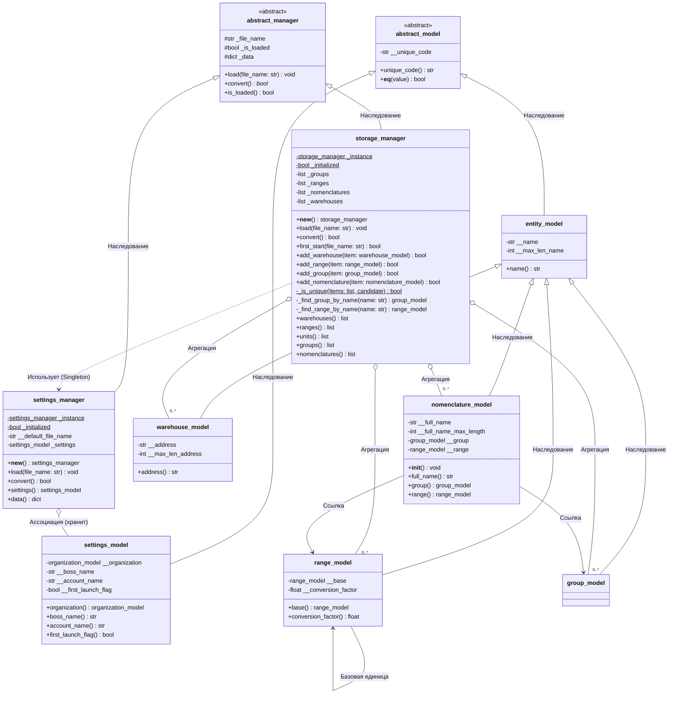
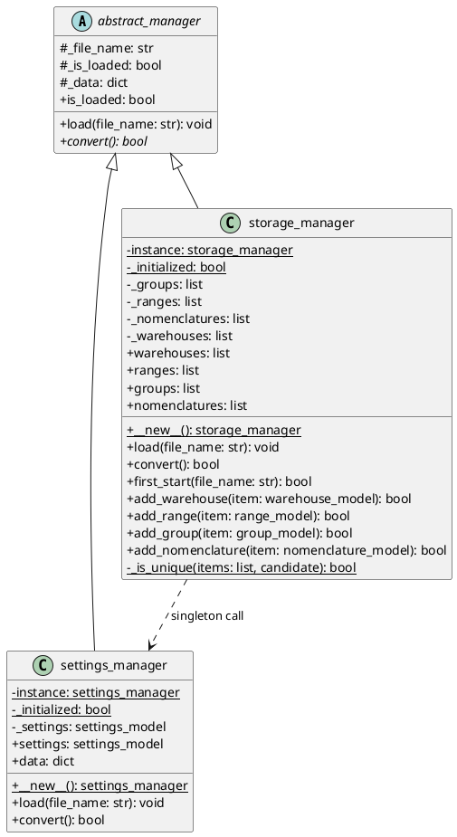
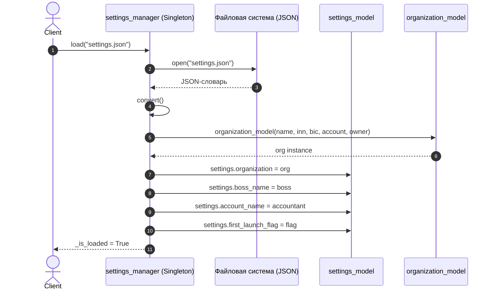
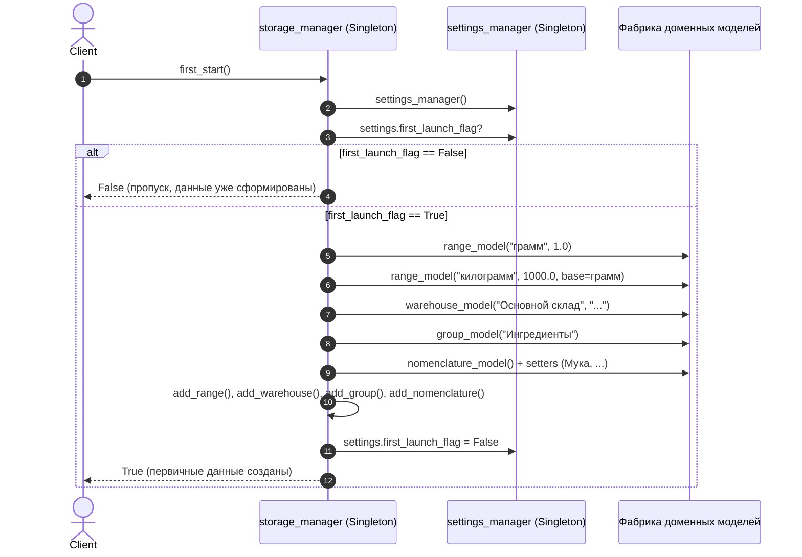

# UML диаграммы для `settings_manager` и `storage_manager`

В данном документе представлены UML-диаграммы классов и последовательностей, описывающие архитектуру менеджеров настроек и хранилища данных. Диаграммы оформлены в формате **Mermaid** (рендерится в GitVerse и GitHub) и продублированы в формате **PlantUML**.

---

## 1. Диаграмма классов (Class Diagram)

### 1.1. Mermaid

### 1.2. PlantUML

---

## 2. Диаграмма последовательности: Загрузка настроек (`settings_manager.load`)

---

## 3. Диаграмма последовательности: Первый старт (`storage_manager.first_start`)

