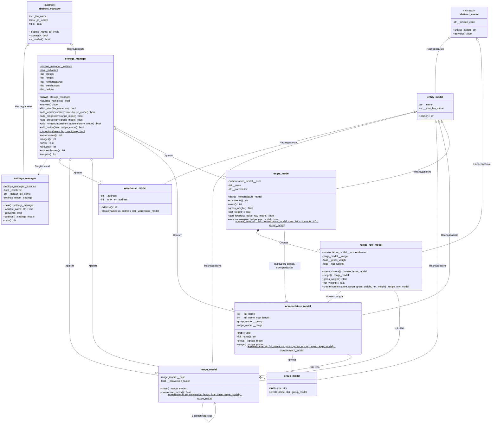
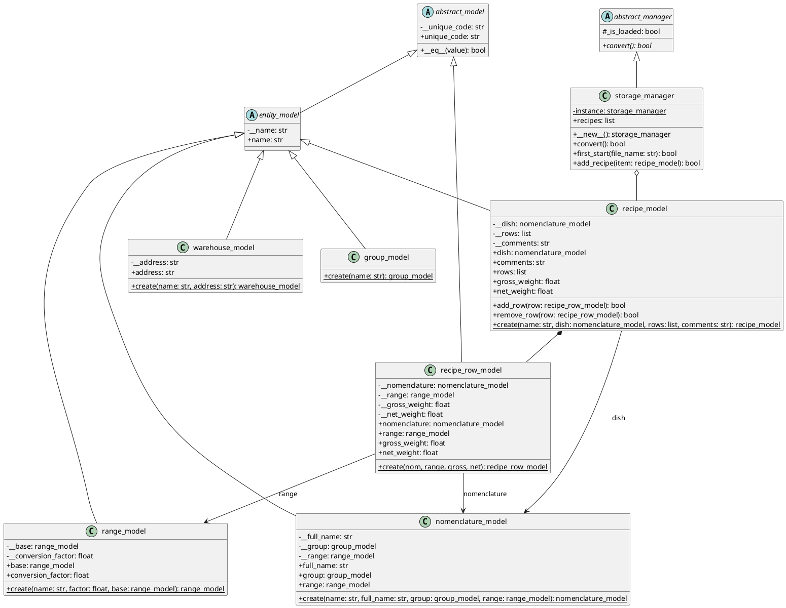
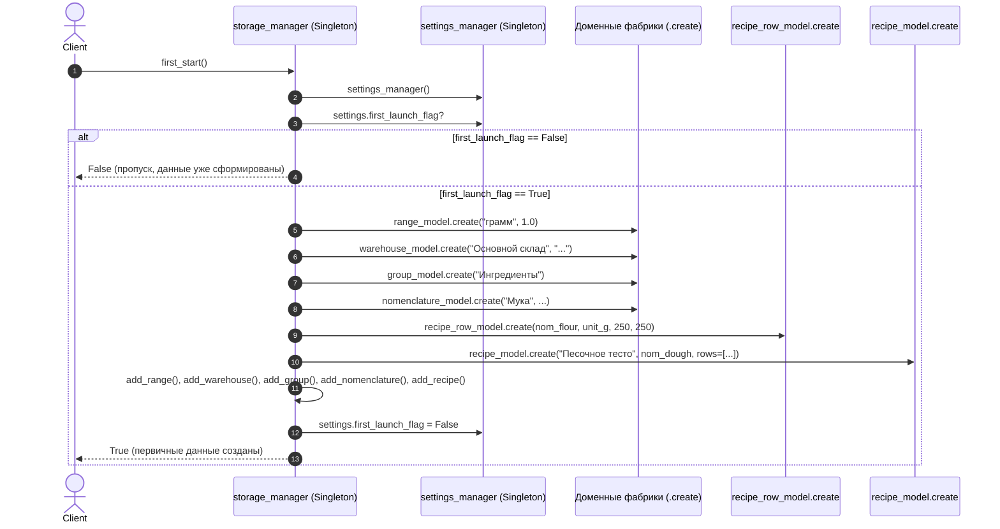

# UML диаграммы для моделей данных, `settings_manager` и `storage_manager`

В данном документе представлены UML-диаграммы классов и последовательностей, описывающие архитектуру приложения, доменных моделей (включая технологические карты/рецепты, полуфабрикаты и упаковку), а также менеджеров настроек и хранилища данных.

---

## 1. Диаграмма классов (Class Diagram)

### 1.1. Mermaid

### 1.2. PlantUML

---

## 2. Диаграмма последовательности: Первый старт с фабричными методами (`storage_manager.first_start`)

